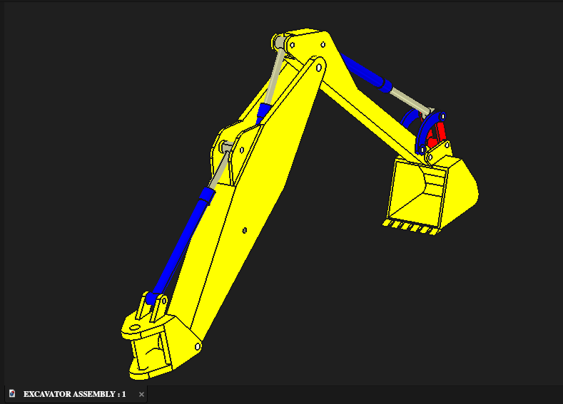
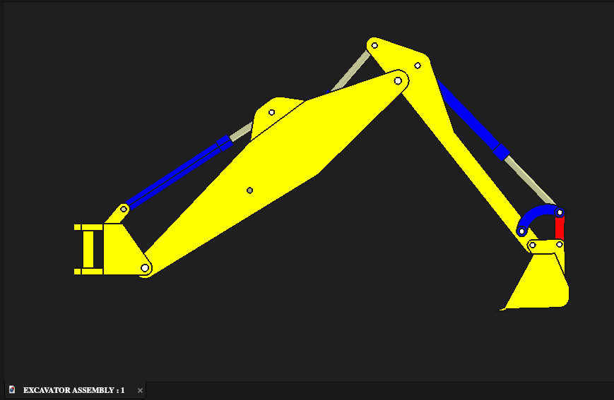
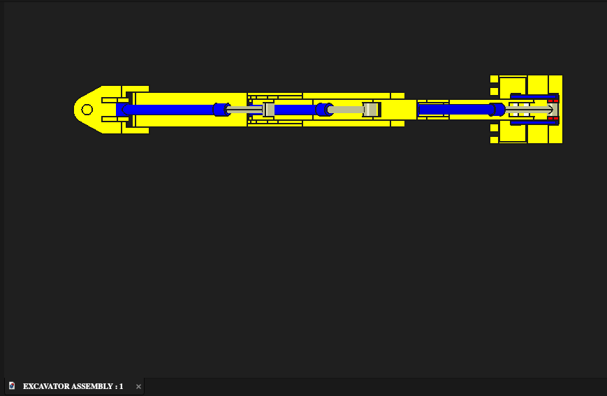
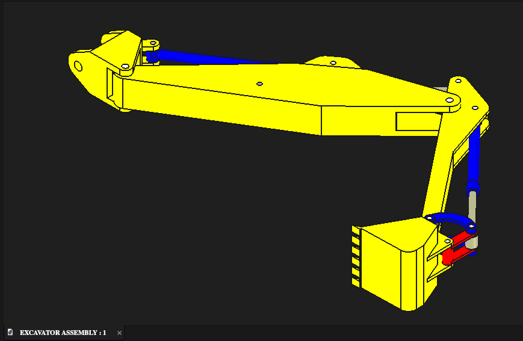
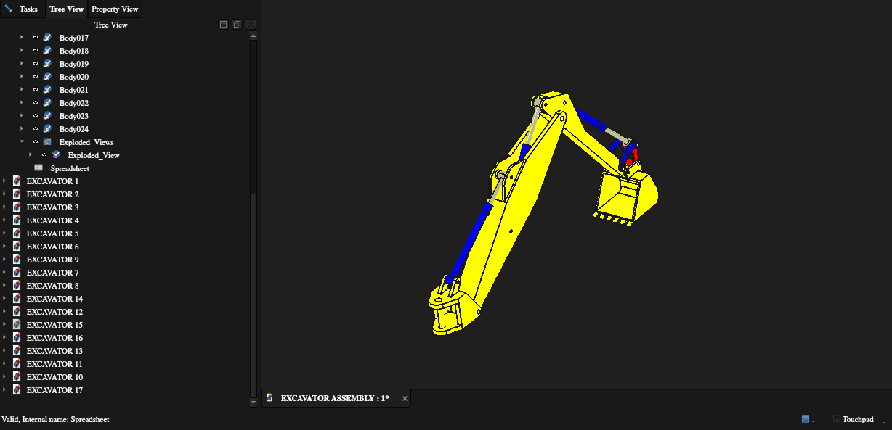

# Excavator Assembly

## Project Overview

This is a university CAD project completed in FreeCAD. The instructor provided the required dimensions and specifications, and I independently modeled the individual components and developed the complete excavator assembly.

## My Role

I completed the CAD work for the project, including:

- Individual component modeling
- Complete assembly development
- Component positioning and integration
- Engineering drawing/documentation work

## CAD Workflow

The project was developed using:

- **Part Design** — individual component modeling
- **Assembly** — assembling and positioning the components
- **TechDraw** — technical drawing generation
- **Sheets** — organizing drawing outputs

The workflow started with interpreting the supplied dimensions and specifications, followed by modeling the components individually and then integrating them into the complete assembly.

## Project Views

### Complete Assembly

### Isometric View

### Front View

### Top View

### Bottom View

### Assembly Tree

## Skills Demonstrated

- 3D parametric CAD modeling
- Mechanical component modeling
- Mechanical assembly design
- Component positioning and integration
- Interpretation of engineering dimensions
- Technical drawing preparation
- CAD documentation
- FreeCAD Part Design
- FreeCAD Assembly
- FreeCAD TechDraw

## Source Files

The models folder contains the individual FreeCAD component files and the completed assembly file.

## Project Context

**Type:** University/class project  
**CAD software:** FreeCAD  
**Input:** Instructor-provided dimensions and specifications  
**My contribution:** Individual component modeling and complete assembly development

> The dimensions and specifications were provided by the instructor. The CAD modeling and assembly work were completed by me.
