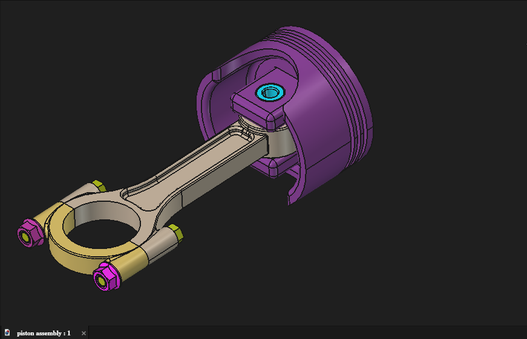
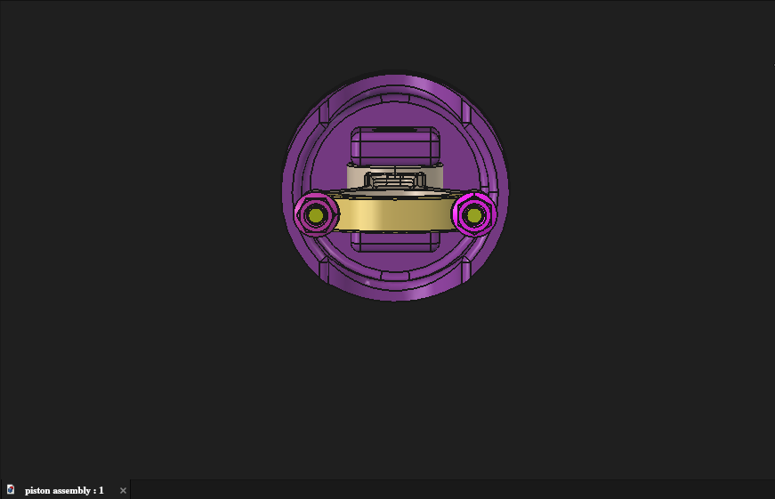
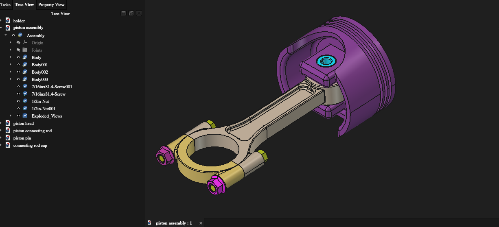
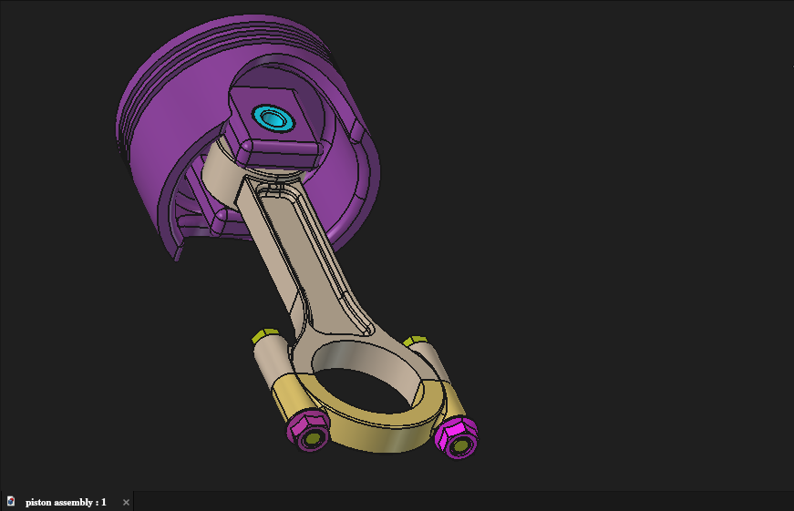

# Piston Assembly

## Project Overview

A mechanical CAD project developed in FreeCAD to model and assemble a piston mechanism from individually modeled components. The project demonstrates parametric part modeling, assembly organization, component integration, and presentation of the completed mechanism from multiple views.

## My Work

- Modeled the individual piston components
- Developed the complete assembly
- Positioned and integrated the components within the assembly
- Organized the CAD model into reusable part files and an assembly file
- Prepared multiple visual views for documenting the finished assembly

## CAD Workflow

- **Part Design** — individual mechanical component modeling
- **Assembly** — component positioning and assembly development
- **CAD documentation** — organized model files and visual project views

## Project Views

### Isometric View

### Bottom View

### Assembly / Part List

### Additional Project View

## Skills Demonstrated

- 3D parametric CAD modeling
- Mechanical component modeling
- Mechanical assembly design
- Component positioning and integration
- CAD model organization
- Technical visualization and documentation
- FreeCAD Part Design
- FreeCAD Assembly

## Source Files

The `models/` directory contains the editable FreeCAD files for the complete assembly and its individual components.

## Project Context

This project is included as part of my mechanical engineering CAD portfolio and demonstrates hands-on experience taking individual mechanical components through modeling and assembly into a structured CAD deliverable.

