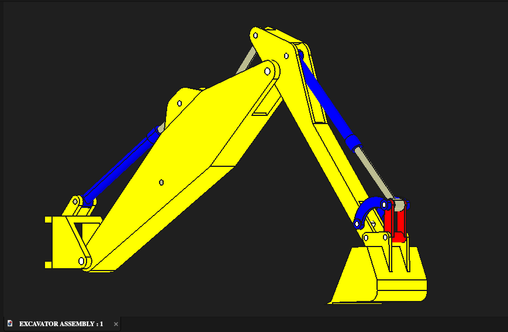

# CAD Portfolio — Edwin Njogu

**Mechanical Engineering | 3D CAD | Mechanical Assemblies | Technical Documentation**

Welcome to my mechanical engineering CAD portfolio. This repository showcases selected projects developed in **FreeCAD**, covering individual part modeling, mechanical assemblies, component integration, and CAD documentation.

The portfolio is focused on demonstrating practical CAD workflow: taking mechanical design requirements or reference dimensions, building structured parametric models, integrating components into assemblies, and presenting the finished work clearly.

## Portfolio Projects

| Project | Focus | Status |
|---|---|---|
| [Excavator Assembly](./Excavator/) | Multi-component mechanical assembly, individual part modeling, TechDraw documentation | Complete |
| [Geneva Mechanism](./Geneva-Mechanism/) | Mechanism components and assembly integration | Complete |
| [Piston Assembly](./Piston-Assembly/) | Piston, connecting rod and component assembly | Complete |
| [Spot Drill](./Spot-Drill/) | Mechanical components and assembly integration | Complete |

## Featured Work

### Excavator Assembly

A university CAD project in which I modeled the individual components and developed the complete excavator assembly using instructor-provided dimensions and specifications.

**Workflow:** Part Design → Assembly → TechDraw → Sheets

[View Excavator project →](./Excavator/)

### Geneva Mechanism

A mechanical mechanism project containing individually modeled components and a complete assembly.

**Workflow:** Part Design → Assembly

[View Geneva Mechanism →](./Geneva-Mechanism/)

### Piston Assembly

A piston and connecting-rod assembly demonstrating structured part modeling and mechanical component integration.

**Workflow:** Part Design → Assembly

[View Piston Assembly →](./Piston-Assembly/)

### Spot Drill

A mechanical spot-drill assembly demonstrating individual component modeling, assembly development, and technical visualization.

**Workflow:** Part Design → Assembly

[View Spot Drill →](./Spot-Drill/)

## CAD Skills

### Modeling
- 3D parametric mechanical modeling
- Mechanical component design
- Feature-based part modeling
- Design interpretation from engineering dimensions

### Assembly
- Multi-component assembly development
- Component positioning and integration
- Assembly organization
- Mechanical design visualization

### Documentation
- Engineering drawing interpretation
- TechDraw
- Drawing sheets
- CAD project documentation
- Technical presentation of design work

## Software

- **FreeCAD**
  - Part Design
  - Assembly
  - TechDraw
  - Sheets

## How This Portfolio Is Organized

Each project has its own directory containing:

- **README.md** — project overview, workflow, skills, and visual documentation
- **images/** — selected project screenshots and views
- **models/** — editable FreeCAD `.FCStd` source files

This structure makes the portfolio easy to review while keeping the original CAD source files available.

## Reviewing the CAD Files

The portfolio includes editable FreeCAD `.FCStd` source files rather than flattened images alone. To inspect the actual geometry and feature history, download the relevant model files and open them in FreeCAD.

The **images/** directories provide quick visual references, while the **models/** directories provide the underlying CAD source.

## Project Context

These projects represent hands-on mechanical engineering CAD work completed during my engineering studies. Where instructor-provided dimensions or specifications were used, the portfolio distinguishes those requirements from the CAD work I completed.

My goal is to build designs that are not only visually complete, but also **structured, editable, and understandable to another engineer**.

---

**Edwin Njogu**  
Mechanical Engineering | CAD / CAM | Mechanical Design
