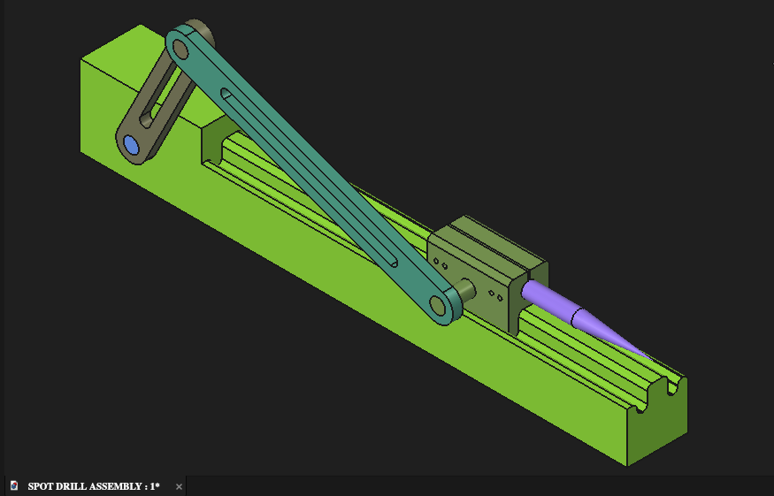
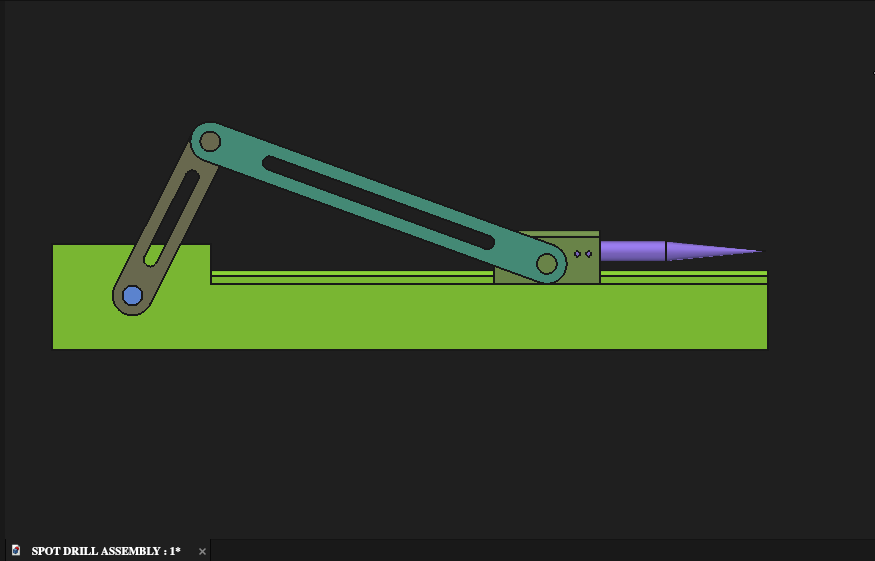
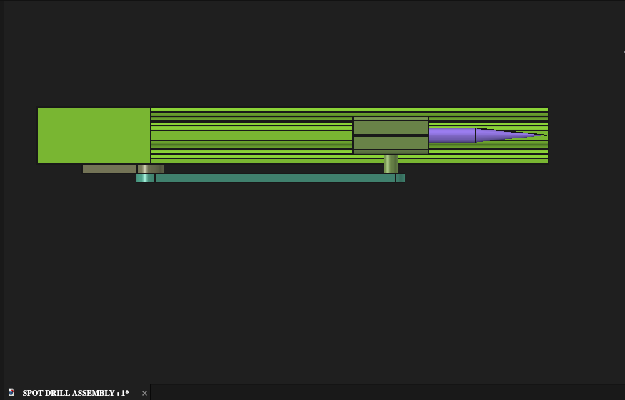
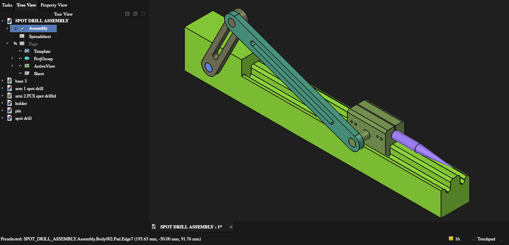
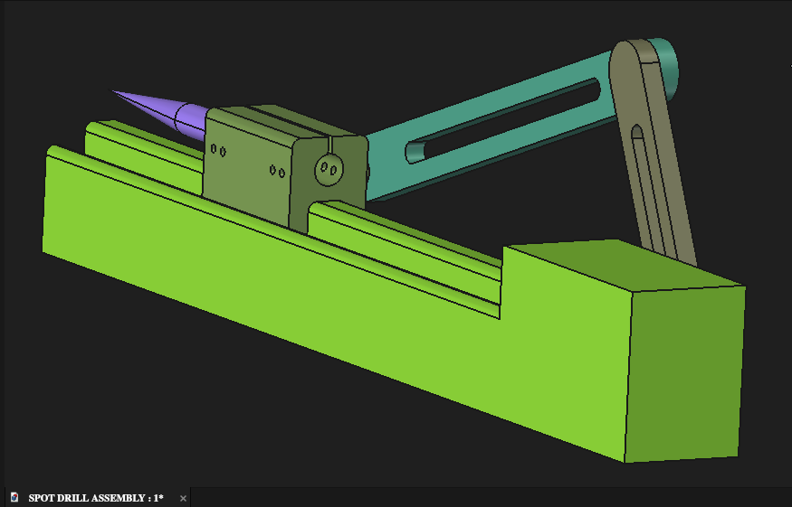

# Spot Drill Assembly

## Project Overview

A mechanical CAD project developed in FreeCAD featuring a spot-drill assembly with individually modeled components. The project demonstrates mechanical part modeling, assembly development, component integration, and technical visualization.

## My Work

- Modeled the individual mechanical components
- Developed the complete spot-drill assembly
- Positioned and integrated the components
- Organized the assembly and component files into a structured CAD project
- Prepared multiple views to document the completed design

## CAD Workflow

- **Part Design** — individual component modeling
- **Assembly** — component positioning and assembly development
- **CAD documentation** — structured model files and visual project documentation

## Project Views

### Isometric View

### Front View

### Top View

### Assembly / Part List

### Additional Project View

## Skills Demonstrated

- 3D parametric CAD modeling
- Mechanical component modeling
- Mechanical assembly design
- Component positioning and integration
- CAD model organization
- Technical visualization and documentation
- FreeCAD Part Design
- FreeCAD Assembly

## Source Files

The `models/` directory contains the editable FreeCAD files for the complete assembly and individual components.

## Project Context

This project is included as part of my mechanical engineering CAD portfolio and demonstrates practical CAD workflow from individual part modeling to a structured mechanical assembly.

